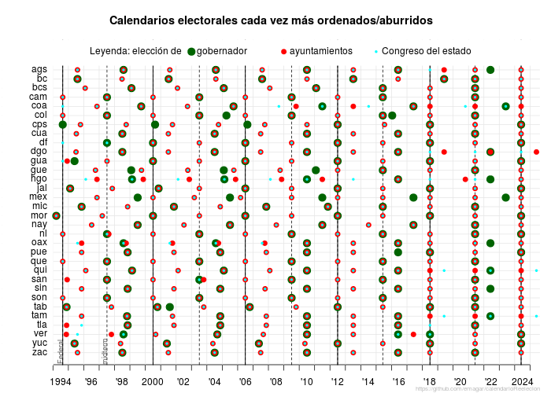

# Table of Contents

Libro de códigos para fechasEleccionesMexicoDesde1994.csv

Codebook for fechasEleccionesMexicoDesde1994.csv

<table border="2" cellspacing="0" cellpadding="6" rules="groups" frame="hsides">

<colgroup>
<col  class="org-left" />

<col  class="org-left" />
</colgroup>
<thead>
<tr>
<th scope="col" class="org-left">columna</th>
<th scope="col" class="org-left">dato reportado</th>
</tr>
</thead>

<tbody>
<tr>
<td class="org-left">edon</td>
<td class="org-left">Código del estado (compatibles con INEGI, exceptuando el cero que indica la federación).</td>
</tr>

<tr>
<td class="org-left">elec</td>
<td class="org-left">Las filas ‘gob’, ‘dloc’ y ‘ayun’ reportan, respectivamente, la información de las elecciones gubernatorial, de diputados estatales y de ayuntamientos municipales. En el caso federal (primeras tres filas) reporta la información de las elecciones presidencial, de diputados y de senadores.</td>
</tr>

<tr>
<td class="org-left">yr1st</td>
<td class="org-left">El año de la primera elección en que los ocupantes (incumbents) pueden contender para reelegirse.</td>
</tr>

<tr>
<td class="org-left">nTerms</td>
<td class="org-left">Número de periodos consecutivos que puede permanecer un ocupante.</td>
</tr>

<tr>
<td class="org-left">y1994-y2025</td>
<td class="org-left">Día y mes de la elección correspondiente al año de la columna (dos guiones indican que no se celebró elección ese año).</td>
</tr>
</tbody>
</table>

<table border="2" cellspacing="0" cellpadding="6" rules="groups" frame="hsides">

<colgroup>
<col  class="org-left" />

<col  class="org-left" />
</colgroup>
<thead>
<tr>
<th scope="col" class="org-left">column</th>
<th scope="col" class="org-left">data reported</th>
</tr>
</thead>

<tbody>
<tr>
<td class="org-left">edon</td>
<td class="org-left">State number (INEGI-compatible excepting zero which indicates the federal level).</td>
</tr>

<tr>
<td class="org-left">elec</td>
<td class="org-left">Rows ‘gob’, ‘dloc’ and ‘ayun’ report, respectively, the information for gubernatorial, state legislative, and municipal elections. For the federal case (top three rows) the information is for the presidential, federal deputy, and senatorial elections.</td>
</tr>

<tr>
<td class="org-left">yr1st</td>
<td class="org-left">Year in which first incumbents are allowed to run for reelection.</td>
</tr>

<tr>
<td class="org-left">nTerms</td>
<td class="org-left">Number of consecutive terms that incumbent can serve (term limits apply afterwards).</td>
</tr>

<tr>
<td class="org-left">y1994-y2025</td>
<td class="org-left">Day and month of the election for year in column (double hyphen indicates that no election was held that year).</td>
</tr>
</tbody>
</table>

